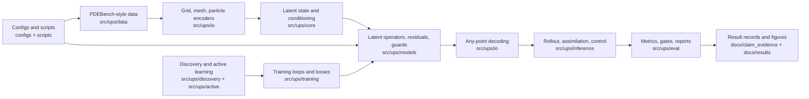

# Universal Physics Stack (UPS)

Universal Physics Stack is research software for latent-space neural simulation
of PDE-style physical systems. It encodes physical fields into compact latent
states, evolves them with transformer-style operators, decodes predictions at
query points, and evaluates physical-space rollouts with reproducible result
records.

## Results At A Glance

Matched `light-v1` held-out decoded rollout NRMSE, lower is better:

| Row | NRMSE | Scope |
| --- | ---: | --- |
| UPS primary | `0.4166` | Primary held-out UPS result |
| Persistence baseline | `0.5702` | Non-learned reference |
| Fourier baseline | `0.5637` | Repo-native neural baseline |
| NeuralOperator UNO | `0.5561` | Third-party model rerun under `light-v1` |
| CNO1d | `0.5919` | Official-source CNO adapter under `light-v1` |
| PDEBench U-Net | `0.6096` | Official PDEBench architecture adapter |
| NeuralOperator FNO | `0.6392` | Canonical FNO family under `light-v1` |

The generated figures and tables live in `docs/results/`. The source records
under `docs/claim_evidence/` capture protocol, split, metric, command, artifact
hashes, and baseline context.

## Architecture



## Run Locally

```bash
pip install -e .[dev]
pytest -q tests/unit
python scripts/build_public_assets.py --check
```

For deterministic local setup:

```bash
bash scripts/prepare_env.sh
```

Run a bounded light experiment:

```bash
python scripts/run_light_experiment.py \
  --config configs/train_multitask_heterogeneous_light_best.yaml \
  --name local_light_check \
  --output-root reports/research/local_light_check
```

Some experiments require PDEBench data, GPU hardware, W&B, B2/S3, or remote
compute credentials. Keep credentials in environment variables or ignored local
files; do not commit them.

## Repository Map

- `src/ups/core`: latent state, conditioning, and PDE-transformer blocks.
- `src/ups/io`: grid, mesh, particle, and any-point encode/decode paths.
- `src/ups/models`: latent operators, residual/corrector modules, physics guards, and factor-graph pieces.
- `src/ups/training`: losses, loops, optimizers, curricula, and distributed helpers.
- `src/ups/data`: schemas, datasets, transforms, collate logic, and PDEBench helpers.
- `src/ups/inference`: rollout, data assimilation, and control utilities.
- `src/ups/eval`: metrics, calibration, gates, and reports.
- `configs/`: training and evaluation configs.
- `scripts/`: local, remote, audit, and asset-generation entrypoints.
- `docs/`: public overview, research notes, runbooks, and result records.

## Start Here

- `docs/results/README.md`: generated figures, benchmark tables, and regeneration command.
- `docs/public/README.md`: public overview and current result scope.
- `docs/public/reproducibility.md`: how to inspect records and reproduce local checks.
- `docs/public/artifact_policy.md`: what belongs in Git versus external artifact storage.
- `docs/research/2026-06-04-universal-simulator-literature-and-ecosystem-landscape.md`: research landscape and technical blocker framing.

## Artifacts

UPS intentionally separates source code from generated artifacts:

- small result records live in `docs/claim_evidence/`;
- broader research notes live in `docs/research/`;
- generated checkpoints, raw datasets, W&B runs, provider logs, and ad hoc remote outputs stay out of normal Git.

The committed bundles under `docs/claim_evidence/artifacts/` are compact result
bundles for reproducibility, not a general artifact store.

## Status

- License: Apache-2.0.
- Python: 3.10+.
- Package status: research alpha.
- CI: GitHub Actions runs lint and unit tests on Python 3.10.

Current technical north star: improve decoded physical-space rollout quality
across task families while preserving validation/test separation and artifact
traceability. The most important measured blocker is long-horizon transport and
advection phase tracking.
