# Results

This directory contains public-facing figures and benchmark tables generated from
committed UPS result records. The source records live under
`docs/claim_evidence/`; the files under `docs/results/generated/` are their
visual and tabular rendering.

## Current Figures

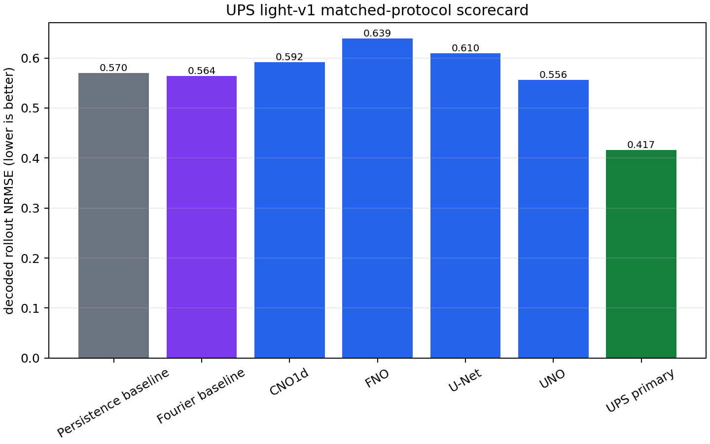

The scorecard compares the primary UPS result against persistence, a repo-native
Fourier neural baseline, and measured third-party baselines run under the same
legacy `light-v1` protocol. Lower decoded rollout NRMSE is better. These are
matched-protocol comparisons, not broad held-out-generalization claims.

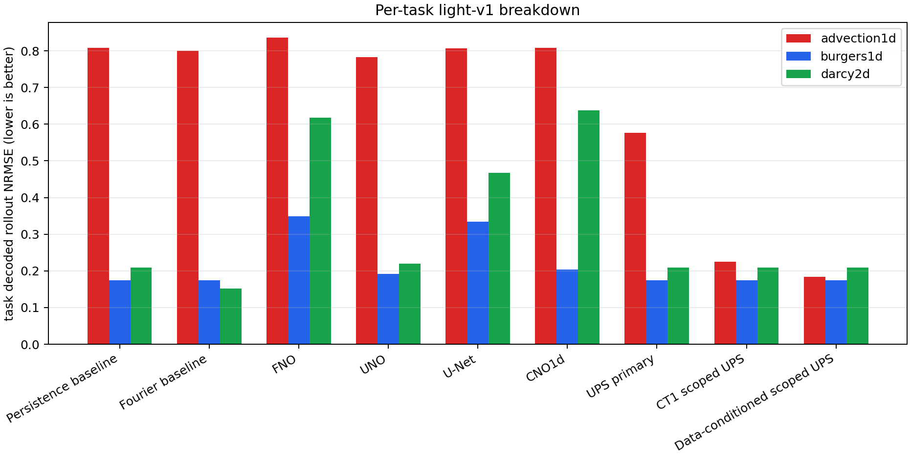

The per-task view shows the shape of the result inside this bounded protocol.
Burgers test trajectories occur in training, Advection reuses initial
conditions while extrapolating transport speed, and Darcy is
trajectory-disjoint. Scoped context variants are shown separately because they
do not have the same inference contract as the primary UPS result.

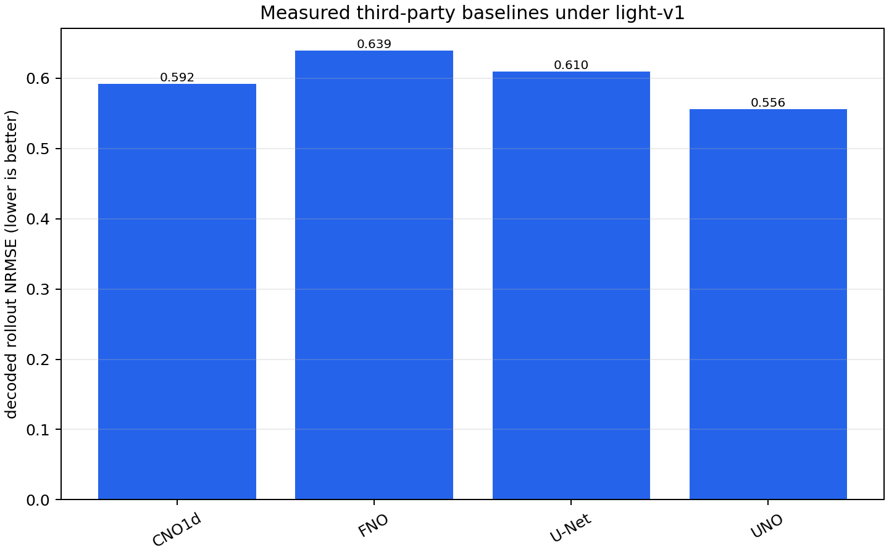

The external baseline chart includes only third-party model families already
rerun under this repository's `light-v1` split, horizon, and metric. Published
paper table values are not mixed into this chart.

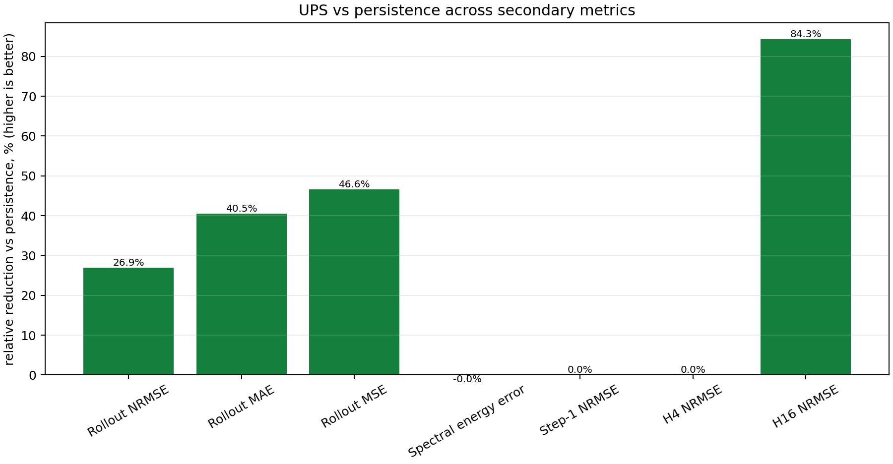

The secondary metric suite compares the primary UPS result against persistence
on additional metrics already present in committed records. It is diagnostic,
not a replacement for the primary decoded rollout NRMSE table. The current
shape is useful: UPS improves rollout MAE/MSE and H16 error, while step-1, H4,
and spectral energy error are approximately neutral versus persistence.

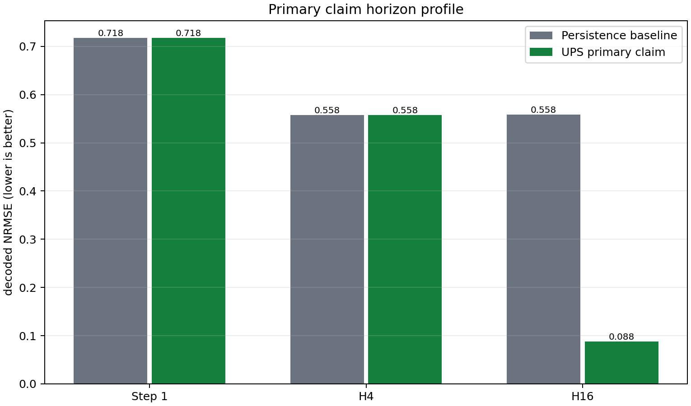

The horizon profile shows why the aggregate number should be read as a
longer-horizon rollout result rather than a broad one-step accuracy result.

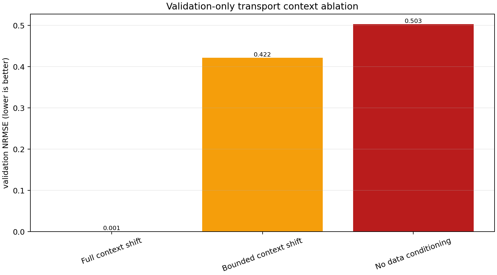

The transport ablation chart is validation-only. It shows that the strong
transport result depends on context/teacher information: the full context-shift
variant is much better than bounded-shift or no-data-conditioning ablations.

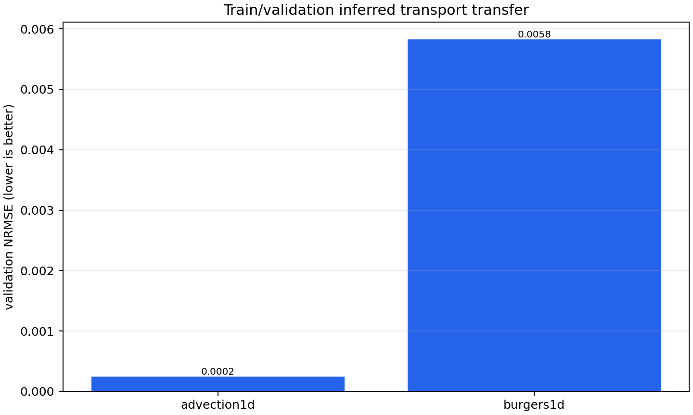

The transfer chart is also train/validation only, not a held-out result. It
shows the currently tracked inferred transport transfer result on the
tasks that were evaluated; Darcy is skipped in the source scorecard because the
train split was missing.

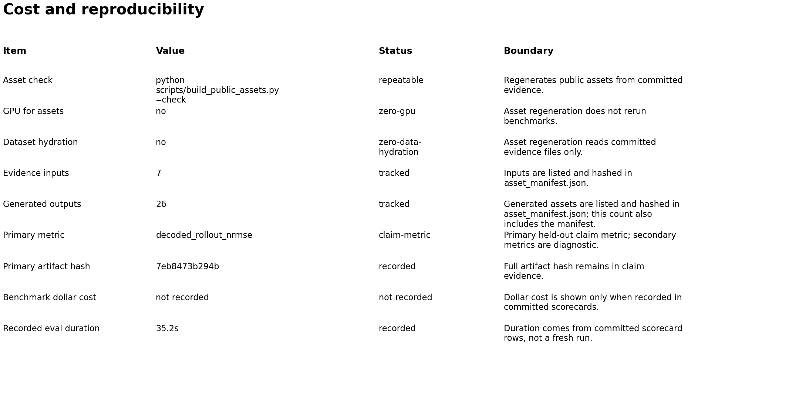

The reproducibility card records the current public results package: asset
regeneration is zero-GPU and reads committed records only, generated outputs are
hashed, and benchmark dollar cost is omitted when it is not recorded in the
committed scorecards.

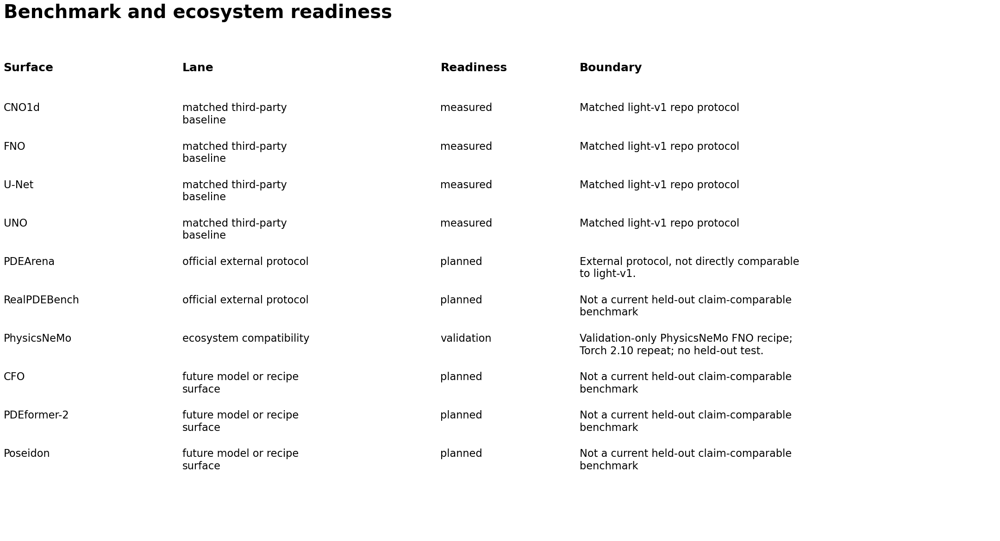

The readiness card separates measured matched-protocol third-party baselines
from planned official external protocols, ecosystem compatibility checks, and
future model/recipe surfaces.

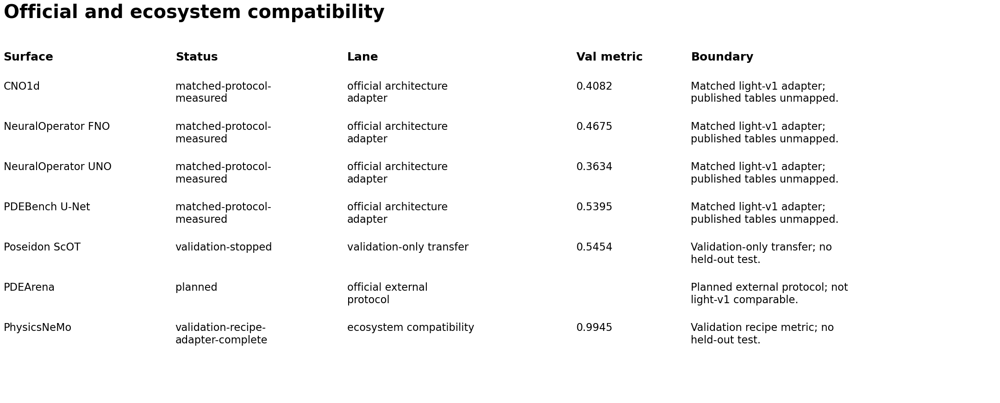

The compatibility card expands the readiness view into concrete official
adapters and protocol gates: NeuralOperator, PDEBench U-Net, and CNO1d are
measured matched-protocol adapters; Poseidon is validation-only and stopped
before held-out test; PDEArena remains a planned protocol surface; PhysicsNeMo
now has a validation-only live FNO recipe-adapter metric, but no held-out or
published-protocol framework result.

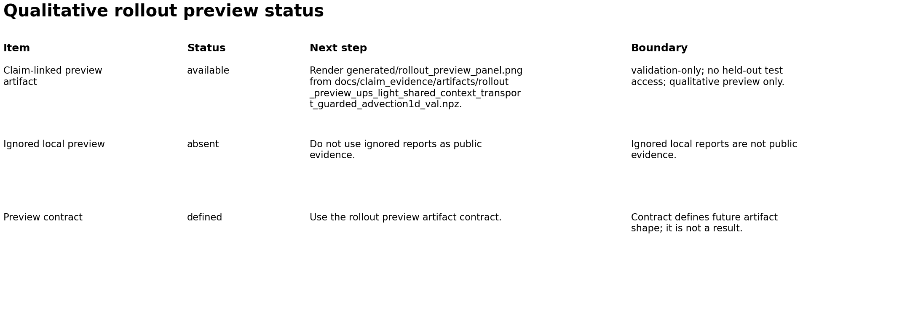

Qualitative rollout panels remain gated on a compact linked preview artifact.
Ignored local `reports/` files are not used as public results.
When `docs/claim_evidence/rollout_preview_manifest.json` exists and validates,
the generator also writes a qualitative `generated/rollout_preview_panel.png`
and `generated/rollout_preview_summary.tsv`.

## Generated Tables

- `generated/benchmark_summary.tsv`: aggregate metric table for primary UPS,
  persistence, local neural, third-party, and scoped UPS rows.
- `generated/per_task_summary.tsv`: per-task rollout NRMSE breakdown.
- `generated/metric_suite_summary.tsv`: primary UPS versus persistence across
  additional committed metrics.
- `generated/horizon_summary.tsv`: step-1, H4, and H16 decoded NRMSE profile.
- `generated/transport_ablation_summary.tsv`: validation-only context ablation
  metrics for the transport result.
- `generated/transfer_validation_summary.tsv`: train/validation inferred
  transport transfer rows, including skipped tasks.
- `generated/reproducibility_card.tsv`: cost, input/output, hash, and local
  regeneration facts.
- `generated/benchmark_readiness_summary.tsv`: measured third-party baselines,
  official external protocols, and ecosystem compatibility surfaces.
- `generated/ecosystem_compatibility_summary.tsv`: official architecture
  adapters, validation-only transfer gates, planned protocol adapters, and
  smoke-ready ecosystem adapters.
- `generated/rollout_preview_status.tsv`: current status of qualitative rollout
  preview artifacts.
- `generated/rollout_preview_summary.tsv`: conditional metadata table for a
  validated qualitative rollout preview artifact.
- `generated/external_benchmark_matrix.tsv`: measured and future external
  benchmark surfaces.
- `generated/benchmark_summary.json`: machine-readable bundle containing all
  rows and input record paths.
- `generated/asset_manifest.json`: input and output hashes plus the
  repeatability check command.

## Regeneration

Run from the repository root:

```bash
python scripts/build_public_assets.py
```

To verify committed generated assets are up to date without rewriting them:

```bash
python scripts/build_public_assets.py --check
```

PNG bytes can differ across operating systems because Matplotlib delegates font
rasterization to platform-specific FreeType builds. CI therefore verifies every
source-derived JSON/TSV output byte-for-byte with:

```bash
python scripts/build_public_assets.py --check --check-structured-only
```

The default `--check` remains the stronger same-environment verification for
PNG files and `asset_manifest.json` as well as the structured outputs.

The generator reads:

- `docs/claim_evidence/universal_sota_claim_evidence.json`
- `docs/claim_evidence/external_baseline_mapping.json`
- `docs/claim_evidence/artifacts/light_v1_demo_scorecard.json`
- `docs/claim_evidence/rollout_preview_manifest.json` when a linked
  preview artifact has been committed.

No GPU, dataset hydration, or remote credentials are required. If any source
record changes, regenerate these assets in the same change so the public figures
remain record-driven.

The generator is deterministic for the committed inputs. `--check` regenerates
all tables and figures in a temporary directory and compares them against the
committed files byte-for-byte.

## Scope

These figures report legacy `light-v1` results measured under this repository's
frozen mixed protocol. The split-integrity audit found train contamination for
Burgers, reused initial conditions plus regime extrapolation for Advection, and
clean disjoint splits for Darcy. Comparisons remain scoped and internally
matched, but should not be read as broad generalization evidence. New primary
generalization results wait for `strat-v1`. These figures do not mix in
published PDEBench, NeuralOperator, CNO, Poseidon, PDEArena, PhysicsNeMo, or
RealPDEBench paper tables unless a compatible rerun or mapping exists.

See `../research/2026-07-09-split-integrity-audit.md` for the audit and
`../research/2026-07-09-strat-v1-advection-root.md` for replacement-protocol
progress.

See `metrics_beyond_nrmse.md` for the secondary metric interpretation and the
next metrics that would require new evaluator outputs.

See `research_diagnostics.md` for the validation-only diagnostic figures and
their scope notes.

See `credibility_cards.md` for the cost/reproducibility and benchmark-readiness
cards, and `rollout_preview_artifact_contract.md` for the artifact format that
should gate future qualitative panels.
