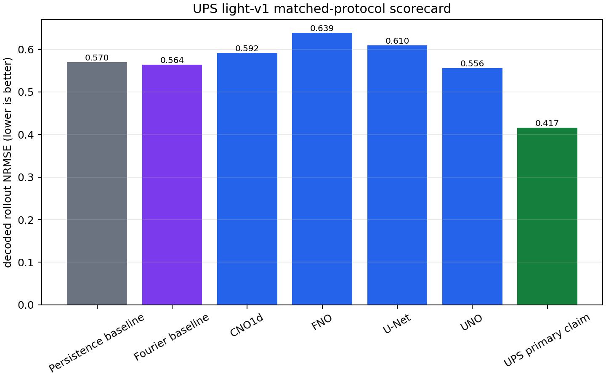
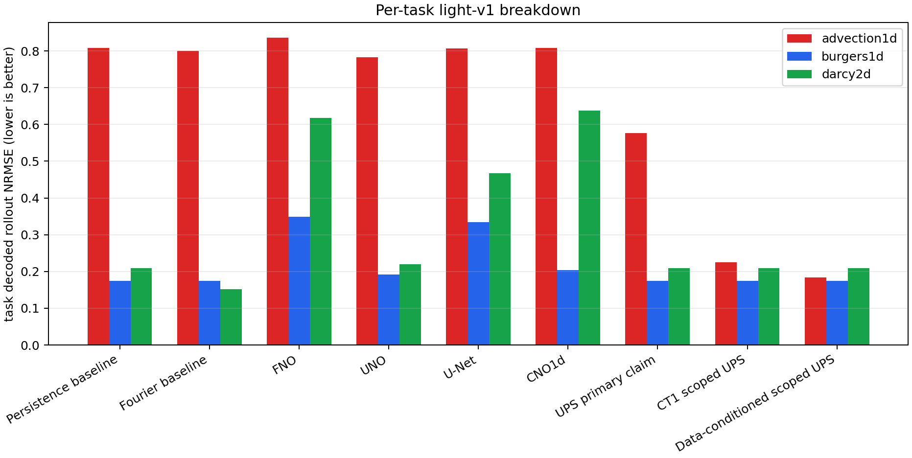
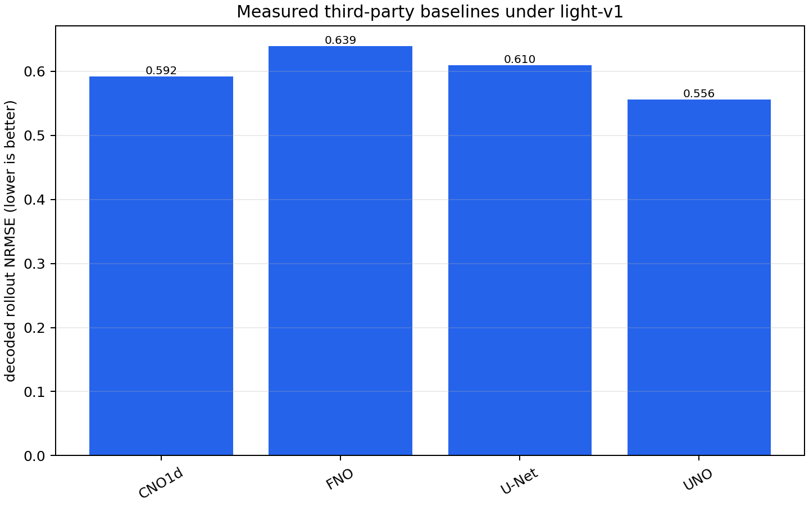
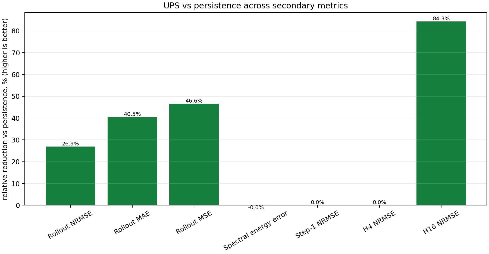
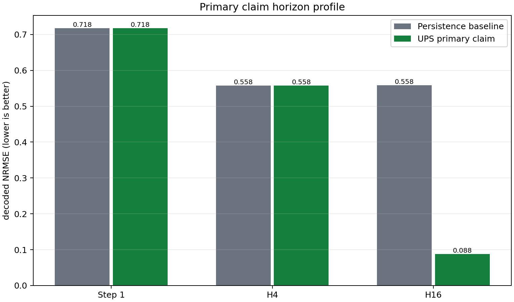
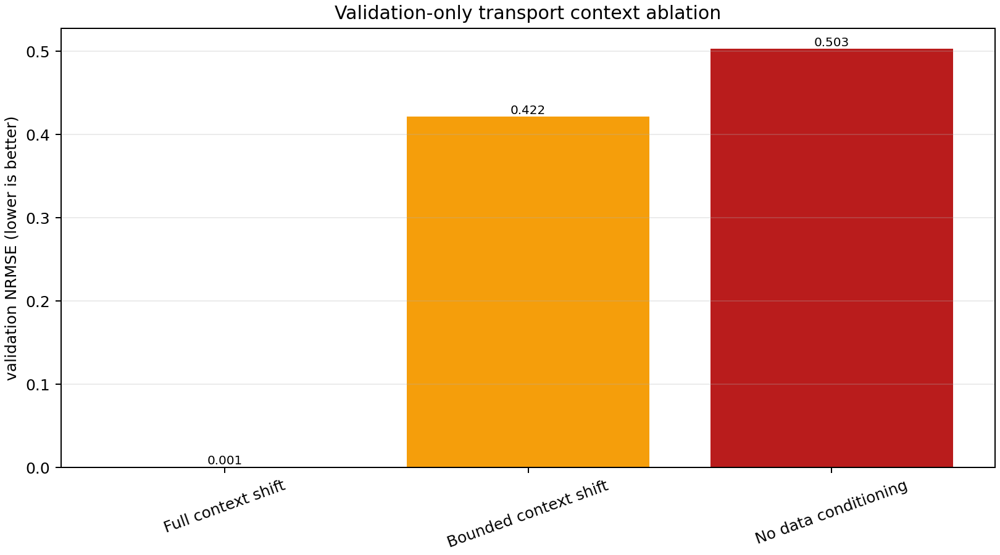
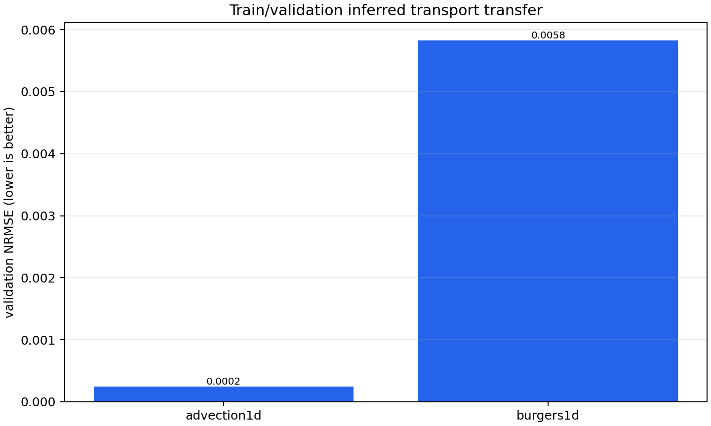
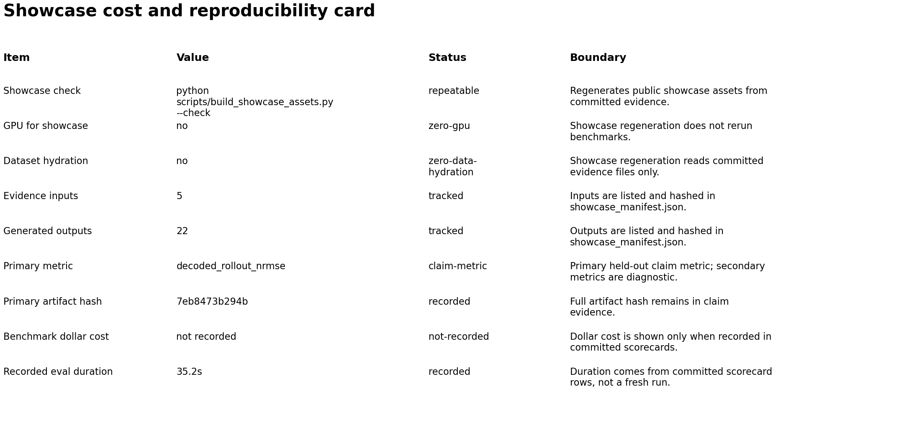
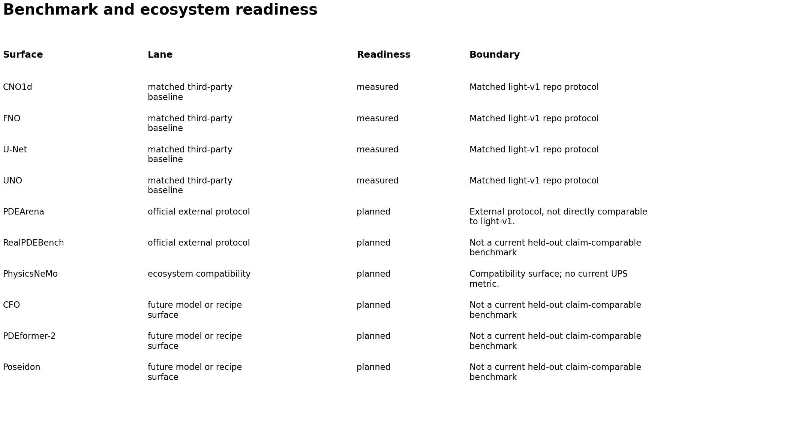
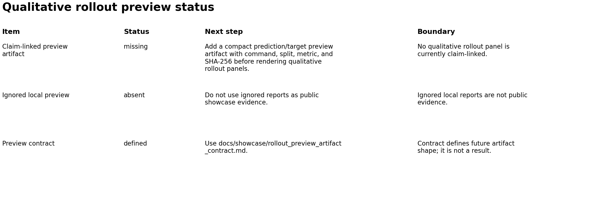

# Showcase

This directory contains public-facing figures and benchmark tables generated from
committed UPS evidence. The source of truth is still `docs/claim_evidence/`;
the files under `docs/showcase/generated/` are a visual and tabular rendering of
that evidence.

## Current Figures



The scorecard compares the guarded UPS primary claim against persistence, a
repo-native Fourier neural baseline, and measured third-party baselines run
under the same `light-v1` claim protocol. Lower decoded rollout NRMSE is better.



The per-task view shows the important shape of the result: advection/transport
is the dominant long-horizon difficulty, while Burgers and Darcy are already
near the strongest baselines in this bounded protocol. Scoped context variants
are shown as separate variants because they do not have the same inference
contract as the primary UPS claim.



The external baseline chart includes only third-party model families already
rerun under this repository's `light-v1` split, horizon, and metric. Published
paper table values are not mixed into this chart.



The secondary metric suite compares the primary UPS claim against persistence
on additional metrics already present in committed evidence. It is diagnostic,
not a replacement for the primary decoded rollout NRMSE claim. The current
shape is useful: UPS improves rollout MAE/MSE and H16 error, while step-1, H4,
and spectral energy error are approximately neutral versus persistence.



The horizon profile shows why the aggregate claim should be read as a
longer-horizon rollout result rather than a broad one-step accuracy claim.



The transport ablation chart is validation-only. It shows that the strong
transport result depends on context/teacher information: the full context-shift
variant is much better than bounded-shift or no-data-conditioning ablations.



The transfer chart is also train/validation evidence, not a held-out public
claim. It shows the currently tracked inferred transport transfer result on the
tasks that were evaluated; Darcy is skipped in the source scorecard because the
train split was missing.



The reproducibility card records the current public evidence surface: showcase
regeneration is zero-GPU and reads committed evidence only, generated outputs
are hashed, and benchmark dollar cost is not shown because it is not recorded in
the committed scorecards.



The readiness card separates measured matched-protocol third-party baselines
from planned official external protocols, ecosystem compatibility checks, and
future model/recipe surfaces.



Qualitative rollout panels remain gated on a compact claim-linked preview
artifact. Ignored local `reports/` files are not used as public evidence.

## Generated Tables

- `generated/benchmark_summary.tsv`: aggregate metric table for primary UPS,
  persistence, local neural, third-party, and scoped UPS rows.
- `generated/per_task_summary.tsv`: per-task rollout NRMSE breakdown.
- `generated/metric_suite_summary.tsv`: primary UPS versus persistence across
  additional committed metrics.
- `generated/horizon_summary.tsv`: step-1, H4, and H16 decoded NRMSE profile.
- `generated/transport_ablation_summary.tsv`: validation-only context ablation
  metrics for the transport result.
- `generated/transfer_validation_summary.tsv`: train/validation inferred
  transport transfer rows, including skipped tasks.
- `generated/reproducibility_card.tsv`: cost, input/output, hash, and local
  regeneration facts.
- `generated/benchmark_readiness_summary.tsv`: measured third-party baselines,
  official external protocols, and ecosystem compatibility surfaces.
- `generated/rollout_preview_status.tsv`: current status of qualitative rollout
  preview evidence.
- `generated/external_benchmark_matrix.tsv`: measured and future external
  benchmark surfaces.
- `generated/benchmark_summary.json`: machine-readable bundle containing all
  rows and input evidence paths.
- `generated/showcase_manifest.json`: input and output hashes plus the
  repeatability check command.

## Regeneration

Run from the repository root:

```bash
python scripts/build_showcase_assets.py
```

To verify committed showcase assets are up to date without rewriting them:

```bash
python scripts/build_showcase_assets.py --check
```

The generator reads:

- `docs/claim_evidence/universal_sota_claim_evidence.json`
- `docs/claim_evidence/external_baseline_mapping.json`
- `docs/claim_evidence/artifacts/light_v1_demo_scorecard.json`

No GPU, dataset hydration, or remote credentials are required. If any claim
evidence changes, regenerate these assets in the same change so the public
figures remain source-of-truth driven.

The generator is deterministic for the committed inputs. `--check` regenerates
all tables and figures in a temporary directory and compares them against the
committed files byte-for-byte.

## Claim Boundary

The figures support a bounded claim: UPS has measured held-out `light-v1`
results under this repository's protocol and beats the measured baselines shown
there on decoded rollout NRMSE. They do not claim broad superiority over
published PDEBench, NeuralOperator, CNO, Poseidon, PDEArena, PhysicsNeMo, or
RealPDEBench paper results unless those results are rerun or mapped under a
compatible protocol.

See `metrics_beyond_nrmse.md` for the secondary metric interpretation and the
next metrics that would require new evaluator outputs.

See `research_diagnostics.md` for the validation-only diagnostic figures and
their claim boundaries.

See `credibility_cards.md` for the cost/reproducibility and benchmark-readiness
cards, and `rollout_preview_artifact_contract.md` for the artifact format that
should gate future qualitative panels.
